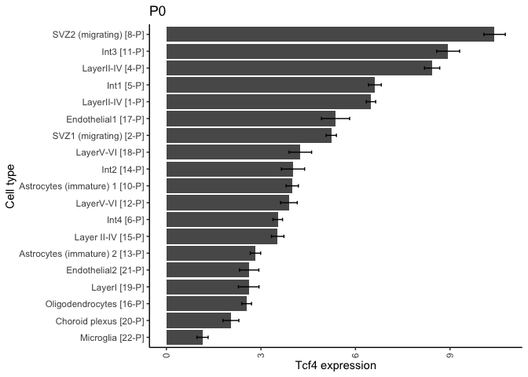
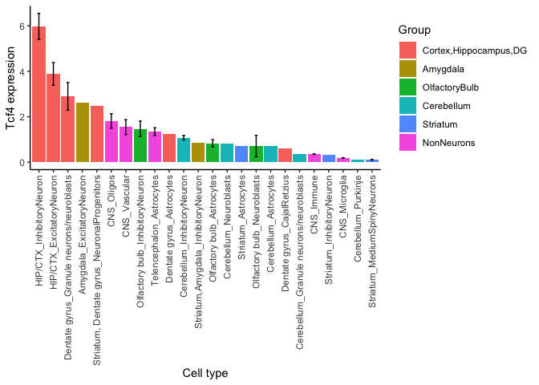

## Kim et al. 2021 (in preparation)

This repository contains `R` code to generate some of the figures
presented in Kim *et al.* 2021 (*under review*).

We used publicly available scRNA-seq data in early postnatal (P0) and
adult mice to illustrate the cell types in which Tcf4 is most highly
expressed.

Early postnatal (P0) mouse scRNA-seq data were downloaded from [GEO
accession
GSE123335](https://www.ncbi.nlm.nih.gov/geo/query/acc.cgi?acc=GSE123335),
corresponding to [Loo et
al 2019](https://www.nature.com/articles/s41467-018-08079-9).

Adult mouse scRNA-seq data were obtained from [this
repository](http://mousebrain.org/downloads.html), corresponding to
[Zeisel et
al 2018](https://www.cell.com/cell/fulltext/S0092-8674\(18\)30789-X).

Expression for Tcf4 was averaged across all cells from a given cell
type.

Additionally, in the case of the adult mouse data, clusters were grouped
into principal cell types and brain regions as follows:

  - Any cell type containing the string “GLU” were designated as
    “ExcitatoryNeuron”

  - Any cell type containing the string “INH”, or named “OBNBL4”,
    “OBNBL5”, “OBDOP”, or “TECHO” were designated as
    “InhibitoryNeuron”

  - Cell types named “CBNBL”, “OBNBL1”, “OBNBL2”, or “OBNBL3” were
    designated as “Neuroblasts”

  - Cell types named “DGNBL” or “GRC” were designated as “Granule
    neurons/neuroblasts”

  - “SZNBL” were renamed to “NeuronalProgenitors”

  - “MSN” were renamed to “MediumSpinyNeurons”

  - “MGL” were renamed to “Microglia”

  - “CR” were renamed to “CajalRetzius”

  - “CBPC” were renamed to “Purkinje”

  - Data from Cortex, Hippocampus, and Dentate Gyrus (DG) were grouped
    into “Cortex,Hippocampus,DG”

  - Data from Pons, or generically named “Brain” was renamed “Other”

  - Data from regions generically named “CNS” or “Telencephalon”) were
    grouped into “NonNeurons”

Plots were generated in `R` version 4.0.2 and plotted with `ggplot2`.
Error bars represent the standard error.

## Load packages

    library(loomR)
    library(tidyverse)

## Read in postnatal expression data and metadata. Remove non-cortical cells.

``` r
p0 = read_tsv("P0_combined_matrix.txt") %>% 
    pivot_longer(cols=starts_with("p0"))
```

    ## 
    ## ── Column specification ──────────────────────────────────────────────────────────────────────────────────────────────────────────────
    ## cols(
    ##   .default = col_double(),
    ##   Gene = col_character()
    ## )
    ## ℹ Use `spec()` for the full column specifications.

``` r
p0_annot = read_tsv("P0_combined_matrix_ClusterAnnotations.txt",col_names=c("name","Cluster"),skip=1) %>%
    mutate(name = str_replace_all(name,"\\.","\\-"))
```

    ## 
    ## ── Column specification ──────────────────────────────────────────────────────────────────────────────────────────────────────────────
    ## cols(
    ##   name = col_character(),
    ##   Cluster = col_character()
    ## )

``` r
p0_joined = left_join(p0,p0_annot,by="name") %>%
    filter(!is.na(Cluster)) %>%
    filter(!str_detect(Cluster, 'eminences|Striatal')) %>%
    add_column(Age = "P0")
```

## Filter data for Tcf4 only, then compute the mean and standard error per cluster, then plot

``` r
p0_joined %>%
    filter(Gene=="Tcf4") %>%
    group_by(Cluster,Age) %>%
    summarize(Mean=mean(value),SE=sd(value)/sqrt(n())) %>%
    ggplot(aes(x=reorder(Cluster,Mean),y=Mean)) +
    geom_col(position=position_dodge(0.9)) +            # Take away position parameter to default to stacked bars
    geom_errorbar(aes(ymin=Mean-SE,ymax=Mean+SE),width=0.2,position=position_dodge(0.9)) +  
    theme_classic() + 
    theme(axis.text.x = element_text(angle = 90, hjust = 1, vjust = 0.5)) +
    xlab("Cell type") +
    ylab("Tcf4 expression") +
    ggtitle("P0") +
    coord_flip()
```

<!-- -->

## Read in adult expression data and metadata

``` r
lfile <- connect(filename = "l5_all.agg.loom", mode = "r",skip.validate=T)
```

    ## Warning in .subset2(public_bind_env, "initialize")(...): Skipping validation step, some fields are not populated

``` r
lin=lfile[["matrix"]][,]
colnames(lin) = lfile[["row_attrs/Gene"]][]
rownames(lin) = lfile[["col_attrs/ClusterName"]][]
lin.t=t(lin)

cluster = lfile[["col_attrs/ClusterName"]][]
region = lfile[["col_attrs/Region"]][]
class = lfile[["col_attrs/Class"]][]
```

## Tidy and join expression and metadata

``` r
lin.tbl = rownames_to_column(as.data.frame(lin.t),var="Gene") %>% 
    as_tibble() %>%
    pivot_longer(cols=!Gene,names_to="Cluster",values_to="Expression")

annot = cbind(cluster,region,class)
colnames(annot) = c("Cluster","Region","Class")
annot.tbl = as.data.frame(annot) %>% as_tibble()

joined = left_join(lin.tbl,annot.tbl)
```

    ## Joining, by = "Cluster"

## Filter data for Tcf4 only, then summarize data by principal cell type and brain region. Compute the mean and standard error, then plot

``` r
joined %>%
    filter(Gene=="Tcf4") %>%
    filter(str_detect(Region, "Cortex") | Region=="Amygdala" | Region=="Telencephalon" | Region=="CNS" | Region=="Dentate gyrus" | str_detect(Region, "Hippocampus") | Region=="Olfactory bulb" | Region=="Brain" | str_detect(Region, "Cerebellum") | str_detect(Region, "Striatum")) %>%
    mutate(
        CellType = case_when(
            str_detect(Cluster, "GLU") ~ "ExcitatoryNeuron",
            str_detect(Cluster, "INH") | str_detect(Cluster, "OBNBL4") | str_detect(Cluster, "OBNBL5") | str_detect(Cluster, "OBDOP") | Cluster=="TECHO" ~ "InhibitoryNeuron",
            str_detect(Cluster, "SZNBL") ~ "NeuronalProgenitors",
            str_detect(Cluster, "CBNBL") | str_detect(Cluster, "OBNBL1") | str_detect(Cluster, "OBNBL2") | str_detect(Cluster, "OBNBL3") ~ "Neuroblasts",
            str_detect(Cluster, "MSN") ~ "MediumSpinyNeurons",
            str_detect(Cluster, "MGL") ~ "Microglia",
            Cluster=="CR" ~ "CajalRetzius",
            Cluster=="CBPC" ~ "Purkinje",
            str_detect(Cluster, "DGNBL") | str_detect(Cluster, "GRC") ~ "Granule neurons/neuroblasts",
            T ~ Class
        )
    ) %>%
    mutate(Region = str_replace_all(Region," dorsal","")) %>%
    mutate(Region = str_replace_all(Region," ventral","")) %>%
    mutate(Region = str_replace_all(Region,"Striatum, Striatum","Striatum")) %>%
    mutate(Region = str_replace_all(Region,"Striatum,Striatum","Striatum")) %>%
    mutate(Region = str_replace_all(Region,"Hippocampus,Cortex","HIP/CTX")) %>%
    mutate(Region = str_replace_all(Region,"Hippocampus","HIP/CTX")) %>%
    mutate(Region = str_replace_all(Region,"Cortex","HIP/CTX")) %>%
    mutate(
        Group = case_when(
            str_detect(Region, "ippo") | str_detect(Region, "ortex") | str_detect(Region, "entate") | str_detect(Region, "HIP/CTX") ~ "Cortex,Hippocampus,DG",
            str_detect(Region, "Amygdala") ~ "Amygdala",
            str_detect(Region, "Striatum") ~ "Striatum",
            str_detect(Region, "Olfactory") ~ "OlfactoryBulb",
            str_detect(Region, "Pons") ~ "Other",
            str_detect(Region, "Cerebellum") ~ "Cerebellum",
            str_detect(Region, "CNS") | str_detect(Region, "Telencephalon") ~ "NonNeurons",
            str_detect(Region, "Brain") ~ "Other",
            T ~ "Other"
        )
    ) %>%
    filter(Group!="Other") %>%
    unite("Cells",c(Region,CellType),sep="_",remove=FALSE) %>%
    group_by(Cells,Group) %>%
    summarize(Mean = mean(Expression),SE=sd(Expression)/sqrt(n())) %>%
    ungroup() %>%
    mutate(Group = str_replace_all(Group,"HIP/CTX","Cortex,Hippocampus,DG")) %>%
    mutate(Group = fct_relevel(Group,c("Cortex,Hippocampus,DG","Amygdala","OlfactoryBulb","Cerebellum","Striatum","NonNeurons"))) %>%
    ggplot(aes(x=reorder(Cells,-Mean),y=Mean,fill=Group,group=Group)) +
    geom_col(position=position_dodge(0.9)) +            # Take away position parameter to default to stacked bars
    geom_errorbar(aes(ymin=Mean-SE,ymax=Mean+SE),width=0.2,position=position_dodge(0.9)) +  
    theme_classic() + 
    theme(axis.text.x = element_text(angle = 90, hjust = 1, vjust = 0.5)) +
    xlab("Cell type") +
    ylab("Tcf4 expression")
```

<!-- -->
